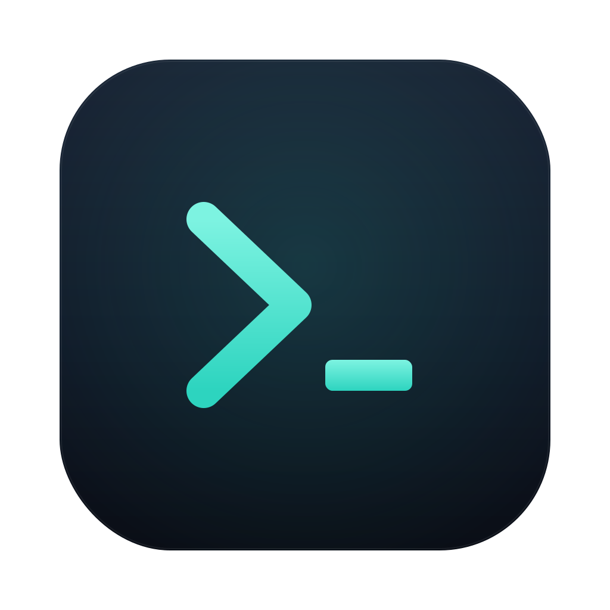
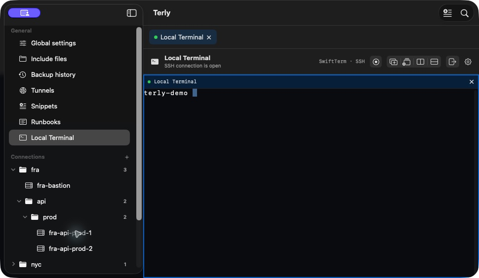
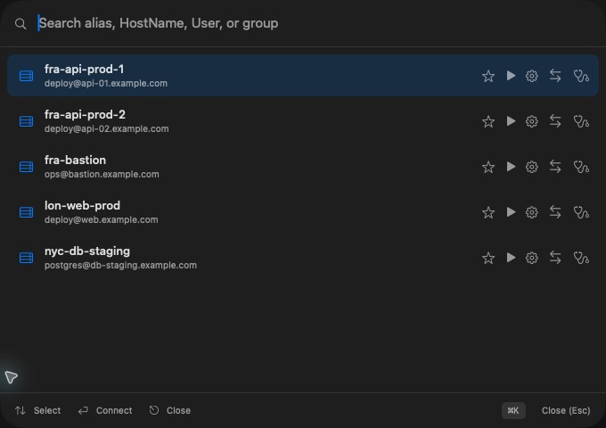
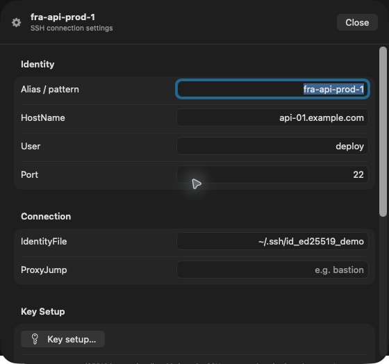

<p align="center">
  
</p>

<h1 align="center">Terly</h1>

<p align="center">
  <strong>Your SSH workspace, built for macOS.</strong><br>
  Organize OpenSSH configs, connect in native terminal workspaces, transfer files,<br>
  run repeatable workflows, and diagnose problems without leaving one app.
</p>

<p align="center">
  <a href="https://github.com/klc/terly/releases/latest"></a>
  
  
  <a href="https://github.com/klc/terly/actions/workflows/ci.yml"></a>
</p>

<p align="center">
  <a href="#download">Download</a> ·
  <a href="#what-you-can-do">Features</a> ·
  <a href="#security-by-default">Security</a> ·
  <a href="README_TR.md">Türkçe</a>
</p>



Terly turns an existing `~/.ssh/config` into a visual, native macOS workspace. It keeps OpenSSH as the source of truth, preserves comments and unknown directives, and puts the day-to-day tools around it: terminal tabs, split panes, file transfer, tunnels, diagnostics, snippets, runbooks, and startup flows.

## Why Terly?

SSH tools often make you choose between a text file that is flexible but hard to navigate and a connection manager that hides your configuration in a proprietary database. Terly keeps the portable OpenSSH config you already own while adding a focused desktop workflow around it.

| Keep your config | Work in one window | Automate the routine |
| --- | --- | --- |
| Lossless parsing preserves comments, `Match`, `Include`, and unknown directives. | Open connections in tabs or split panes with a native SwiftTerm terminal. | Save startup flows, snippets, runbooks, tunnels, and reusable workspaces. |

## What you can do

- **Navigate large SSH configs** with recursive groups derived from aliases such as `fra-api-prod-1`.
- **Edit connections safely** through focused forms or the full raw config editor.
- **Connect your way** using terminal tabs, horizontal or vertical splits, saved workspaces, and synchronized input.
- **Jump anywhere with `⌘K`** by searching aliases, hostnames, users, favorites, recents, and connection groups.
- **Move files without memorizing commands** using Finder for local files and an SFTP browser for remote paths, with queues, retries, progress, and transfer history.
- **Understand failures** with connection diagnostics for DNS, ProxyJump, identities, agent state, `known_hosts`, and end-to-end reachability.
- **Forward ports** with Local (`-L`), Remote (`-R`), and Dynamic (`-D`) tunnels.
- **Standardize connection setup** with startup flows that can switch users, change directories, and run commands in one remote shell context.
- **Run repeatable operations** through snippets and multi-host runbooks.
- **Set up ed25519 keys** with a guided flow that can add the key to `ssh-agent` and copy only the public key to the server.
- **Sync across Macs** through your own private git repository—without a Terly account or intermediary service.

## A closer look

<table>
  <tr>
    <td width="55%">
      
    </td>
    <td valign="top">
      <h3>Everything is a shortcut away</h3>
      <p>Press <code>⌘K</code> to find a connection and connect, edit settings, transfer files, or start diagnostics directly from the result.</p>
    </td>
  </tr>
  <tr>
    <td valign="top">
      <h3>OpenSSH stays readable</h3>
      <p>Edit common fields in a clear native form. Terly writes standard OpenSSH directives and leaves comments and unsupported directives intact.</p>
    </td>
    <td width="45%">
      
    </td>
  </tr>
</table>

## Download

Terly requires **macOS 14 Sonoma or later**.

1. Download the latest `.dmg` from [GitHub Releases](https://github.com/klc/terly/releases/latest).
2. Drag **Terly** into Applications.
3. Open the app. Your existing `~/.ssh/config` is loaded automatically.

Official releases are Developer ID signed, notarized, and updated through Sparkle. Update checks are opt-in and can also be started manually from **Settings → Updates**.

> [!IMPORTANT]
> Terly uses write-through editing: completed changes are written directly to `~/.ssh/config`. Before every write, the current file is backed up. If the file changed externally, Terly refuses to overwrite it and keeps your pending version in memory.

## Security by default

- Private key contents are **never read** by the application.
- Every config write is preceded by a local backup and uses atomic replacement with `0600` permissions.
- Symbolic-link config targets are rejected to avoid writing through an unexpected path.
- SSH, SCP, SFTP, and git commands are executed as argument arrays rather than shell-concatenated strings.
- Host keys are never accepted automatically; diagnostics use strict host-key checking.
- Password and passphrase prompts use an `SSH_ASKPASS` bridge and are never written to arguments, environment variables, logs, or disk.
- Secret snippet values stay in Keychain and are excluded from git synchronization.
- Git sync uses your system git and credentials. Remote changes are previewed and require approval before they touch local files.

Backups and application metadata live under `~/Library/Application Support/Terly/` with restricted permissions. Terminal recordings may contain sensitive command output, so each recording folder is created with `0700` permissions and cast files with `0600`.

## Built for real workflows

### Terminal workspaces

Open hosts in separate tabs or split panes, drag panes to rearrange them, select panes with `⌘`-click for synchronized input, and save the entire layout as a reusable workspace. Per-host auto-reconnect is opt-in and uses bounded backoff after an unexpected disconnect.

### File transfer

Upload or download files and folders with SCP or SFTP. Transfers run through a queue with configurable concurrency, retries, live percentage and speed, checksum verification, overwrite confirmation, and persistent history. Remote rename, new-folder, and safe non-recursive delete actions are built into the browser.

### Startup flows and runbooks

A startup flow runs inside one remote shell context and can switch user, change directory, and execute commands before leaving the terminal interactive. Runbooks apply repeatable commands across multiple hosts while keeping authentication behavior explicit and cancellable.

### Private git synchronization

Sync config, tunnels, snippets, runbooks, favorites, and startup metadata through a private repository you control. Pulls are fast-forward only, incoming changes are shown before application, and diverged histories never trigger a silent line merge or force push.

## Build from source

You need macOS 14+, Xcode with Swift 6 support, and [XcodeGen](https://github.com/yonaskolb/XcodeGen) 2.40 or later.

```sh
git clone https://github.com/klc/terly.git
cd terly
xcodegen generate
open SSHConfigurator.xcodeproj
```

Run the test suite from Terminal:

```sh
CLANG_MODULE_CACHE_PATH=/private/tmp/terly-module-cache swift test
```

The Xcode scheme is named `SSHConfigurator`; the built product is `Terly.app`. Release maintainers can find the signing, notarization, Sparkle, and appcast process in [`docs/RELEASING.md`](docs/RELEASING.md).

## Project status

Terly is actively developed. Bug reports, focused feature proposals, and pull requests are welcome through [GitHub Issues](https://github.com/klc/terly/issues).

<p align="center">
  Built with SwiftUI, <a href="https://github.com/migueldeicaza/SwiftTerm">SwiftTerm</a>, and <a href="https://github.com/sparkle-project/Sparkle">Sparkle</a>.
</p>
